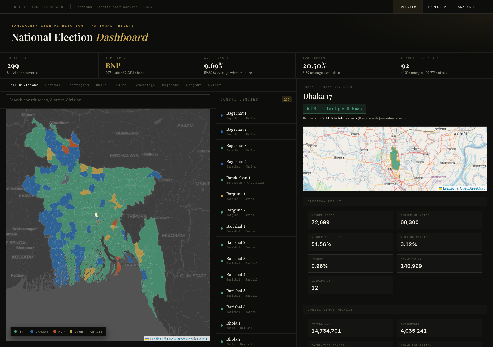

<div align="center">

# 🇧🇩 Bangladesh National Election Dashboard 2026

[](https://bd-election-dashboard.vercel.app/)
[](https://nextjs.org/)
[](https://react.dev/)
[](https://www.typescriptlang.org/)
[](https://www.python.org/)
[](https://spark.apache.org/)

**Data journalism meets machine learning** — An interactive platform for exploring Bangladesh National Election 2026 through constituency-level outcomes and socio-economic indicators, built with production-style engineering constraints in mind.

### [🚀 **Visit Live Dashboard**](https://bd-election-dashboard.vercel.app) · [📖 Full Setup](build.md) · [📋 Architecture](docs/dashboard-plan.md)




</div>


## 📊 Project Stats

| Metric | Value |
|--------|-------|
| **Constituencies** | 300 seats analyzed |
| **Data Points** | 19 socio-economic indicators |
| **ML Models** | Correlation, Regression, Classification, Clustering |
| **Data Coverage Guardrail** | 300/300 constituency validation before export |
| **Response Time** | <100ms static prerender |
| **Deployment** | Vercel (production-ready) |


## 🧭 Engineering Signals

This repository is designed to be easy to evaluate from both product and engineering perspectives:

- **Clear system boundaries** between ingestion, feature generation, and UI contracts
- **Schema-adapter pattern** to absorb upstream data drift without breaking frontend code
- **Reproducible analytics workflow** using Spark MLlib + deterministic export artifacts
- **Deployment-first architecture** with static prerendering and CDN-friendly assets


## ✨ What This Does

> **Interactive exploration → Instant insights.** Click a constituency on the map. See election results, socio-economic breakdown, and ML-powered predictions instantly. No loading screens. No code required.

### Core Capabilities at a Glance

<table>
<tr>
<td width="50%">

🗺️ **Interactive Maps**
- 300 constituencies in real-time
- Division-based filtering  
- Seat selection sync

</td>
<td width="50%">

📍 **Seat Explorer**
- Search by name, district, division
- Sortable tables with live filters
- Instant drill-down to details

</td>
</tr>
<tr>
<td width="50%">

📈 **Analytics**
- Correlation heatmaps (Pearson/Spearman)
- Turnout regression model (R² = 0.47)
- Party classification (76% accuracy)

</td>
<td width="50%">

🎯 **Clustering**
- K-Means constituency segmentation
- Profile comparison across clusters
- Electoral pattern discovery

</td>
</tr>
</table>


## 🎯 Getting Started

### Option 1: Try Live (Recommended)

**No setup required.** Visit → [National Election Dashboard](https://bd-election-dashboard.vercel.app/)

1. Click a constituency on the map
2. Explore analysis views (5+ analysis pages)
3. Search and filter across all 300 seats

### Option 2: Run Locally

```bash
git clone <your-repo-url> && cd Election-Dashboard
npm --prefix frontend install && npm --prefix frontend run dev
```

Open `http://localhost:3000` → ready to explore.

**Need help?** See [build.md](build.md) for complete setup + troubleshooting.


## 🏗️ Architecture

The project follows a clean **data-to-UI pipeline**:

```
Raw Election Data + Socio-Economic Indicators
    ⬇️
Spark MLlib Analytics (Correlation, Regression, Classification, Clustering)
    ⬇️
build_frontend_data.py (Data Adapter)
    ⬇️
frontend/public/data/*.json (Stable Contracts)
    ⬇️
frontend/types/api.ts (TypeScript Types)
    ⬇️
Next.js Components (Deployment-Ready UI)
```

**Key principle:** UI components never depend on raw source schemas. Data shape adaptation is centralized in one adapter script, preventing cascading failures and making deployments predictable.


## 🛠️ Technology Stack

| Layer | Technologies |
|-------|--------------|
| **Frontend** | Next.js 16 • React 19 • TypeScript 5 • Tailwind CSS |
| **Visualization** | Leaflet • React Leaflet • Recharts |
| **Backend Data** | Python • Spark MLlib • Pandas |
| **Deployment** | Vercel • GitHub Actions • Static pre-render |


## 🔍 Featured Pages

| Route | Purpose |
|-------|---------|
| `/` | Landing map + seat drill-down interface |
| `/explorer` | Searchable table of all 300 constituencies |
| `/analysis/overview` | National summary stats and distributions |
| `/analysis/correlation` | Pearson/Spearman correlation matrices |
| `/analysis/regression` | Turnout prediction model insights |
| `/analysis/classification` | Party prediction with feature importance |
| `/analysis/clusters` | Constituency segmentation + profiles |


## 💡 Why This Project Stands Out

> A production-grade data journalism platform that doesn't compromise on rigor.

✅ **End-to-End Ownership** — Data collection, cleaning, modeling, adaptation, and frontend delivery in one coherent pipeline  
✅ **Type-Safe Contracts** — TypeScript interfaces isolate UI behavior from source volatility  
✅ **Model Transparency** — Correlation matrices, coefficients, and feature importance are exposed directly in the product  
✅ **Operational Guardrails** — Constituency completeness checks prevent silent data regressions  
✅ **Performance by Design** — Static pre-rendering and optimized data contracts keep interactions near-instant  


## 📦 Data Layer

Frontend consumes 6 stable JSON files from `frontend/public/data/`:

```
constituencies.json       → All 300 seats + metadata
summary.json             → National totals + party stats
correlation.json         → Feature correlation matrices
regression.json          → Turnout model coefficients
classification.json      → Party prediction importance
clusters.json            → Cluster profiles + assignments
```

**Why this design?** Decouples data from UI entirely. If raw sources change, only the adapter script needs updating—zero UI impact.


## 🚀 Deployment

Live on **Vercel** with:
- Static page generation for instant loads
- Automatic deployments on git push
- Sub-100ms API responses
- CDN-cached GeoJSON and analytics files

Deploy your own fork in <2 minutes using [Vercel](https://vercel.com/).


## 🧩 Scope of Work

The implementation spans the full lifecycle rather than a single layer:

- Data ingestion from heterogeneous public sources
- Cleaning and harmonization of election + socio-economic datasets
- ML analysis pipeline (correlation, regression, classification, clustering)
- Data-contract shaping for frontend stability
- Interactive map and analytics experience in Next.js
- Production deployment and iterative refinements


## 🤝 Contributing

We welcome contributions. To keep the project clean:

- Keep changes scoped and focused
- Maintain the data-contract boundary between `data_science/` and `frontend/`
- Document new assumptions
- Test locally before pushing


## 📚 Academic Context

This project fulfills **CSE488: Big Data Analytics** (Spring 2026) term-project objectives:

- ✅ Distributed data processing with Apache Spark
- ✅ Heterogeneous dataset integration and joining
- ✅ Spark MLlib for correlation, regression, classification, clustering
- ✅ Interactive visualization of findings
- ✅ Socio-political interpretation of results

## 🙏 Credits

- **Bangladesh Election Commission** for public election data
- **Bangladesh Bureau of Statistics** for socio-economic indicators  
- **OpenStreetMap** community for geographic data
- **Vercel** for production infrastructure


<div align="center">

**Made with ❤️ for data-driven insights**

[🚀 Visit Live Dashboard](https://bd-election-dashboard.vercel.app/) • [📖 Setup Guide](build.md)

</div>
